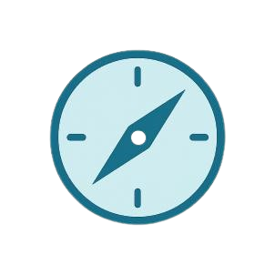
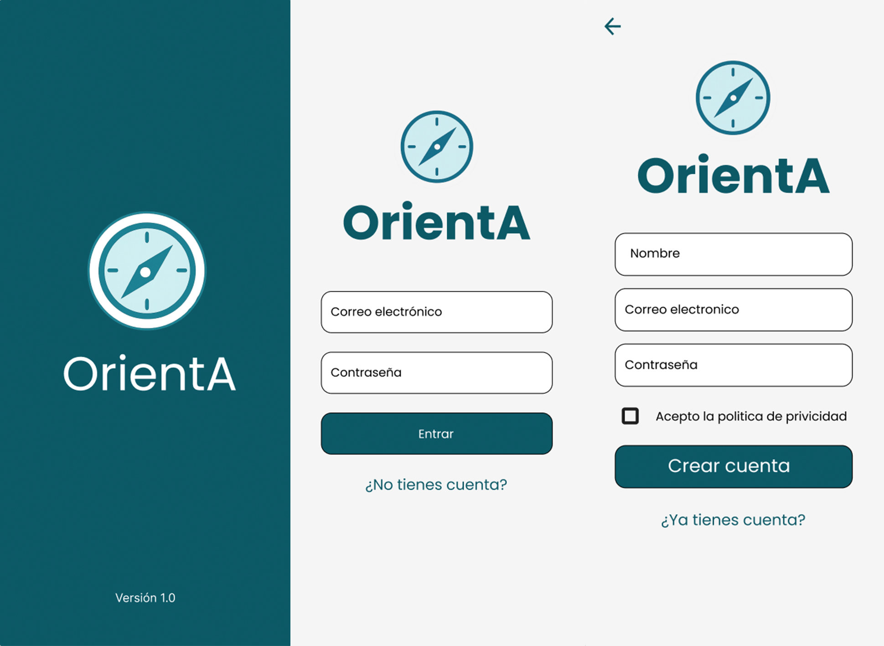
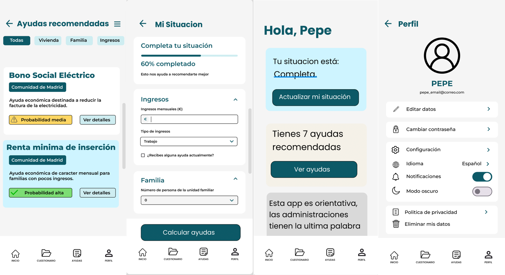

  

  
  
  
  

# OrientA - Ayudas a tu Alcance

Este proyecto consiste en el desarrollo de una aplicación Android con inteligencia artificial que analiza la situación personal del usuario (ingresos, vivienda y familia) para recomendar ayudas sociales, documentación necesaria y cómo solicitarlas.
Está dirigida a personas que necesitan orientación para acceder a prestaciones públicas y, a la vez, sirve como proyecto educativo para el alumnado de 2DAM.

## Authors

- [@apaz-dev](https://www.github.com/apaz-dev)
- [@alvarobueno2112](https://www.github.com/alvarobueno2112)
- [@rauljaro06](https://www.github.com/rauljaro06)

## Screenshots

 

## Color Reference

| Color             | Hex                                                                |
| ----------------- | ------------------------------------------------------------------ |
| Azul claro        |  #CEF4FF |
| Azul más claro    |  #CFEDF1 |
| Azul teal oscuro  |  #0E5967 |
| Marfil suave      |  #F4F1E8 |
| Gris oscuro       |  #D9D9D9 |
| Gris claro        |  #F5F5F5 |
| verde             |  #7DDD75 |
| amarillo          |  #FFD764 |

## Contributing

Las contribuciones siempre son bienvenidas!!!

1. Crea un branch con un nombre descriptivo (por ejemplo `feature/nombre` o `fix/descripcion`)
2. Abre un Pull Request hacia la rama destino (ej. `develop` o `main`) con una descripción clara de los cambios
3. Incluye screenshots o pasos para reproducir si el cambio afecta la UI
4. Asegúrate de que los nuevos menús y diálogos sigan las pautas de originales

## Roadmap

- [ ] Next Step 
